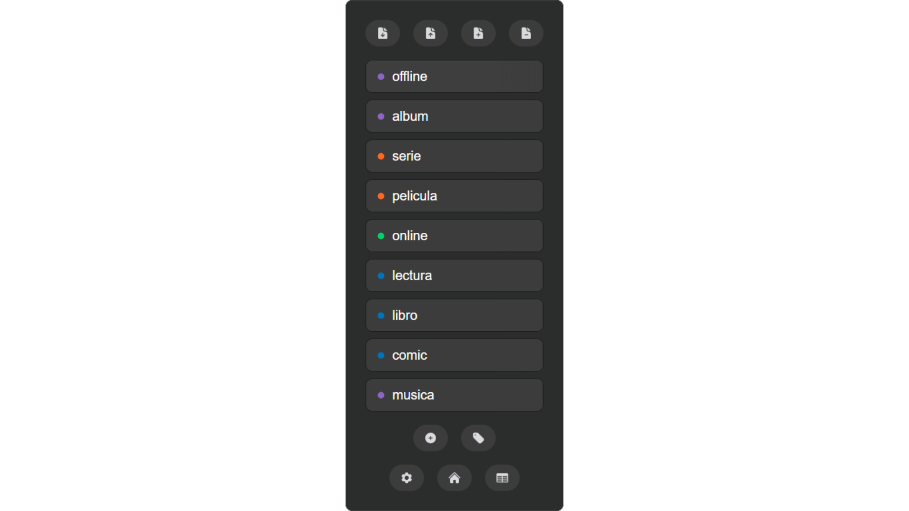

# trackwithslate

**slate** is a local tool for creating, organizing and exporting csv tabular data directly in your browser.  
No internet connection or installation required — just download the html file and it will open as a web page.

Built for people who need a lightweight and local way to manage personal structured data without external dependencies. Ideal for those who prefer simplicity, privacy and control. Not for highly specific professional use but some edge-cases are covered.

All your data stays on your machine without accounts, servers or sync. Just remember to export frequently and before deleting browser data. 

## Features

**slate** is stable and functional, aimed at staying minimal: just open the latest html released and start working.

* **Import/export**: Bring and keep your data in a future proof plain text format (csv with any separator).
* **Record editing**: View, modify and organize entries with ease, including bulk delete and fuzzy search.
* **Autofill categories**: Tag any column as a category to create autofill buttons for every entry under it.
* **Date formats**: Configurable date input with custom format selector and optional autofill with current date.
* **Storage**: Everything is saved in-browser using the built in localstorage and can be easily exported.
* **Field types**: Define columns with custom field types like text, number, date or boolean.
* **Hiper-light**: Compatible with virtually any modern browser including mobile, at just ~100KB.

**WIP**: Nested fields with sub-division symbols > Simple data visualization > Multiple databases

Remember that **your data stays in the browser until you export it!** - back it up regularly if needed.

Pro tip: *save as bookmark for easy access!*

---

  <strong><em>designed with simplicity in mind, to keep you in control</em></strong>
    
  

